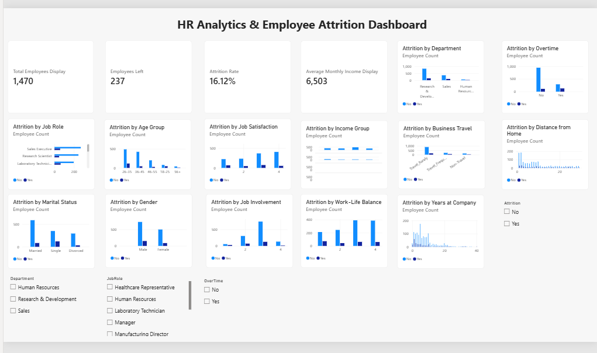

# HR Analytics & Employee Attrition Analysis

## Project Overview

This project focuses on analyzing employee attrition to identify workforce patterns and factors associated with employee turnover.

The analysis uses Python, SQL, and Power BI to explore employee data, calculate attrition rates, and present findings through an interactive dashboard.

## Tools & Technologies

- Python
- Pandas
- NumPy
- Matplotlib
- Seaborn
- MySQL
- Power BI
- Generative AI (ChatGPT)

## Project Workflow

1. Data Loading and Exploration
2. Data Cleaning using Python
3. Exploratory Data Analysis (EDA)
4. SQL-based Analysis
5. Power BI Dashboard Development
6. AI-Assisted Insights and Recommendations

## Key Performance Indicators

- Total Employees: 1,470
- Employees Left: 237
- Overall Attrition Rate: 16.12%
- Average Monthly Income: 6,503

## Key Findings

- Overall employee attrition rate is 16.12%.
- Employees working overtime showed a higher attrition rate than those not working overtime.
- Sales Representatives showed the highest attrition rate among the analyzed job roles.
- Employees with shorter tenure showed higher attrition in this dataset.
- Lower job satisfaction was associated with a higher attrition rate.

## AI-Assisted Insights

Generative AI was used to interpret calculated results, identify important patterns, and formulate business-focused insights and recommendations.

### Insight 1: Overtime and Employee Attrition

Employees working overtime showed a higher attrition rate (30.53%) compared with employees not working overtime (10.44%).

**Business Interpretation:** Overtime status is associated with a higher attrition rate in this dataset.

**Recommendation:** Organizations can review overtime patterns, workload distribution, and employee well-being to identify opportunities for improving employee retention.

### Insight 2: Job Role and Employee Attrition

Sales Representatives had the highest attrition rate (39.76%) among the job roles analyzed, followed by Laboratory Technicians (23.94%) and Human Resources employees (23.08%).

**Business Interpretation:** Attrition varies considerably across job roles, with Sales Representatives showing a notably higher attrition rate in this dataset.

**Recommendation:** Organizations can review workload, career growth opportunities, compensation, and employee engagement across high-attrition roles to support retention.

### Insight 3: Tenure and Employee Attrition

Employees with 0–2 years of experience at the company had the highest attrition rate (29.82%), followed by employees with 3–5 years (13.82%).

**Business Interpretation:** Shorter-tenure employees showed higher attrition rates compared with longer-tenure employees in this dataset.

**Recommendation:** Organizations can strengthen onboarding, early-career support, mentoring, and career development programs to improve employee retention.

### Insight 4: Job Satisfaction and Employee Attrition

Employees with low job satisfaction (Level 1) had an attrition rate of 22.84%, compared with 11.33% among employees with very high job satisfaction (Level 4).

**Business Interpretation:** Lower job satisfaction is associated with a higher attrition rate in this dataset.

**Recommendation:** Organizations can monitor employee satisfaction through regular feedback, engagement initiatives, and workplace improvement programs.

### Insight 5: Job Level and Employee Attrition

Employees at Job Level 1 had the highest attrition rate (26.34%) among the job levels analyzed, while employees at Job Level 4 had the lowest rate (4.72%).

**Business Interpretation:** Attrition was comparatively higher among employees at lower job levels in this dataset.

**Recommendation:** Organizations can provide clear career progression paths, skill development opportunities, and growth-oriented programs for employees at early career levels.

### Insight 6: Business Travel and Employee Attrition

Employees who travelled frequently had a higher attrition rate (24.91%) compared with employees who travelled rarely (14.96%) or did not travel (8.00%).

**Business Interpretation:** Frequent business travel is associated with a higher attrition rate in this dataset.

**Recommendation:** Organizations can review travel frequency, workload, and employee support measures for frequently travelling employees.

### Insight 7: Distance from Home and Employee Attrition

Employees living 21+ km from the workplace had an attrition rate of 22.06%, while employees living within 0–5 km had an attrition rate of 13.77%.

**Business Interpretation:** Longer commuting distance was associated with a comparatively higher attrition rate in this dataset.

**Recommendation:** Organizations can consider flexible work arrangements, transportation support, or hybrid work options where appropriate.
## Power BI Dashboard

## Project Files

- `HR_Analytics_Employee_Attrition.ipynb` – Python analysis
- `sqlanalysis.sql` – SQL queries
- `attrition.pbix` – Power BI dashboard

## Conclusion

This project demonstrates how Python, SQL, Power BI, and Generative AI can be used together to analyze employee attrition patterns and communicate data-driven insights.

**Note:** Findings represent associations in the dataset and do not establish causation.
